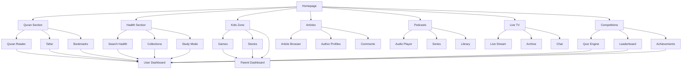

## 1. Product Overview

The Islamic Media Website is a comprehensive digital platform designed to provide authentic Islamic educational content, spiritual resources, and community engagement tools for Muslims worldwide. The platform serves as a centralized hub for Quran study, Hadith learning, Islamic parenting resources, and community building through gamified learning experiences.

**Target Audience**: Muslim families, Islamic educators, children, and adults seeking authentic Islamic knowledge in multiple languages. The platform addresses the need for reliable, engaging, and accessible Islamic educational content with modern user experience design.

**Market Value**: Positioned as a leading Islamic educational technology platform that combines traditional Islamic scholarship with contemporary digital learning methodologies, serving the global Muslim community of 1.8+ billion people.

## 2. Core Features

### 2.1 User Roles

| Role | Registration Method | Core Permissions |
|------|---------------------|------------------|
| Guest User | No registration required | Browse limited content, basic Quran reading |
| Registered User | Email/Social login | Full content access, progress tracking, points system |
| Premium User | Subscription upgrade | Ad-free experience, exclusive content, advanced features |
| Parent User | Account upgrade with verification | Child progress monitoring, family management |
| Admin User | Backend invitation | Content management, user moderation, analytics access |

### 2.2 Feature Module

The Islamic Media Website consists of the following main pages:

1. **Homepage**: Hero section with featured content, navigation menu, prayer times widget, quick access cards for major sections.

2. **Quran Section**: Complete Quran text with multiple translations, audio recitations, tafsir explanations, reading progress tracking, bookmarking system.

3. **Hadith Section**: Authentic Hadith collections with search functionality, categories, narrator chains, commentary, and study guides.

4. **Kids Zone**: Interactive Islamic learning games, animated stories, educational videos, child-friendly Quran lessons, progress tracking for parents.

5. **Articles & Blog**: Islamic articles on various topics, scholar writings, community contributions, comment system, sharing capabilities.

6. **Podcasts & Radio**: Islamic lecture series, daily reminders, scholar talks, downloadable content, playlist creation.

7. **Live TV**: Islamic channels streaming, program schedules, video-on-demand archive, live chat during broadcasts.

8. **Competition Hub**: Weekly/monthly Islamic knowledge contests, quiz tournaments, leaderboard rankings, achievement badges.

9. **User Dashboard**: Personal profile, reading statistics, points balance, achievements, bookmarks, settings.

10. **Parent Dashboard**: Child account management, progress reports, activity monitoring, content filtering controls.

11. **Community Forum**: Discussion boards, Q&A sections, scholar advice, user-generated content moderation.

12. **Prayer & Athan**: Prayer time calculator, Qibla direction, mosque finder, prayer reminder notifications.

### 2.3 Page Details

| Page Name | Module Name | Feature description |
|-----------|-------------|---------------------|
| Homepage | Hero Banner | Display rotating featured Islamic content with call-to-action buttons for Quran, Hadith, and Kids sections |
| Homepage | Prayer Times Widget | Show real-time prayer times based on user location with next prayer countdown and customizable calculation methods |
| Homepage | Quick Access Cards | Provide one-click access to Quran, Hadith, Kids Zone, Articles, and Live TV with icon-based navigation |
| Homepage | Featured Content | Showcase trending articles, popular podcasts, upcoming competitions, and recent Quran recitations |
| Quran Section | Quran Reader | Display Quran text in Arabic with user-selected translation, font size controls, night mode, and audio playback |
| Quran Section | Tafsir Panel | Show contextual explanations and interpretations from renowned scholars alongside verses |
| Quran Section | Bookmark System | Allow users to save favorite verses, create custom collections, and add personal notes |
| Quran Section | Progress Tracker | Monitor reading completion percentage, daily reading goals, and streak maintenance |
| Hadith Section | Search Engine | Enable advanced search by keyword, narrator, collection, topic, and authenticity grade |
| Hadith Section | Collections Browser | Organize Hadith by authentic collections (Bukhari, Muslim, etc.) with filtering and sorting options |
| Hadith Section | Study Mode | Provide guided learning paths with quizzes, explanations, and related Hadith suggestions |
| Kids Zone | Interactive Games | Offer Islamic-themed educational games covering Quran memorization, Prophet stories, and Islamic manners |
| Kids Zone | Animated Stories | Present Prophet stories and Islamic history through engaging animations with moral lessons |
| Kids Zone | Parent Controls | Enable content filtering, screen time limits, and progress sharing with parent accounts |
| Articles Section | Category Browser | Organize articles by topics (Fiqh, Aqeedah, Family, Youth, Converts) with tagging system |
| Articles Section | Author Profiles | Showcase scholar biographies, their articles, and social media integration for following |
| Articles Section | Comment System | Enable moderated discussions with Islamic etiquette guidelines and spam filtering |
| Podcasts Section | Audio Player | Provide continuous playback, speed control, download options, and sleep timer functionality |
| Podcasts Section | Series Management | Group related episodes into series with automatic next episode progression |
| Podcasts Section | Personal Library | Allow users to create custom playlists, mark favorites, and share recommendations |
| Live TV | Channel Guide | Display program schedules, upcoming shows, and channel descriptions with time zone support |
| Live TV | Video Archive | Provide on-demand access to recorded programs with search and categorization |
| Live TV | Interactive Chat | Enable moderated live discussions during broadcasts with Islamic conduct guidelines |
| Competition Hub | Quiz Engine | Generate randomized Islamic knowledge questions with multiple difficulty levels and time limits |
| Competition Hub | Leaderboard System | Display real-time rankings by points, achievements, and competition-specific standings |
| Competition Hub | Achievement System | Award digital badges, certificates, and unlockable content based on performance milestones |
| User Dashboard | Profile Management | Allow users to edit personal information, upload avatars, and manage privacy settings |
| User Dashboard | Statistics Panel | Show reading progress, quiz scores, points earned, and learning streak visualization |
| User Dashboard | Social Features | Enable following other users, sharing achievements, and participating in study groups |
| Parent Dashboard | Child Monitoring | Provide detailed activity reports, content consumption analytics, and learning progress charts |
| Parent Dashboard | Content Filtering | Enable age-appropriate content restrictions, keyword blocking, and safe browsing modes |
| Parent Dashboard | Family Challenges | Create family-wide learning goals, shared reading plans, and group competitions |

## 3. Core Process

### Guest User Flow
The guest user can browse limited content without registration, view Quran text, read selected articles, and listen to public podcasts. Upon attempting to access premium features like progress tracking or competitions, they are prompted to create an account.

### Registered User Flow
Users register with email or social media accounts, complete profile setup with Islamic preferences (madhab, language, interests), and gain access to full features including progress tracking, points system, and community participation.

### Parent User Flow
Parents verify their identity through additional steps, link child accounts, set up monitoring preferences, and access family-specific features like shared reading plans and child progress reports.

### Premium User Flow
Users upgrade to premium through subscription management, gaining ad-free experience, exclusive scholar content, advanced analytics, and priority customer support.

## 4. User Interface Design

### 4.1 Design Style

**Primary Colors**: Islamic Green (#0F9D58), Gold (#F4B400), White (#FFFFFF), Deep Blue (#1A237E)

**Secondary Colors**: Soft Cream (#FFF8E1), Light Green (#C8E6C9), Navy (#283593)

**Button Style**: Rounded corners with subtle shadows, hover effects with color transitions, Islamic geometric patterns on special buttons

**Typography**: Primary - Amiri (Arabic-style serif), Secondary - Open Sans (modern sans-serif), Quran text - Traditional Arabic calligraphy fonts

**Layout Style**: Card-based design with Islamic geometric patterns, responsive grid system, floating navigation with prayer time widget

**Icons**: Islamic-themed custom icons (crescent moon, mosque, prayer beads, Quran), minimal line-art style with cultural authenticity

**Animations**: Subtle parallax effects, smooth page transitions, Islamic geometric pattern morphing, loading animations with Arabic calligraphy

### 4.2 Page Design Overview

| Page Name | Module Name | UI Elements |
|-----------|-------------|-------------|
| Homepage | Hero Banner | Full-width Islamic geometric pattern background, animated Arabic calligraphy, rotating featured content carousel with smooth transitions, call-to-action buttons with hover effects |
| Homepage | Prayer Times Widget | Floating card with gradient background, real-time countdown timer, location-based prayer calculations, expandable detailed view with Qibla direction |
| Quran Section | Quran Reader | Split-pane design with Arabic text on right, translation on left, customizable font sizes, night mode toggle, audio waveform visualization, bookmark ribbon indicators |
| Hadith Section | Search Interface | Advanced search bar with autocomplete, filter sidebar with Islamic category icons, search results displayed in card format with authenticity badges |
| Kids Zone | Game Interface | Colorful Islamic-themed game environment, child-friendly navigation with large buttons, progress bars with Islamic patterns, achievement unlock animations |
| Articles Section | Article Cards | Grid layout with featured image, reading time indicator, author avatar, category tags with Islamic colors, engagement metrics display |
| User Dashboard | Statistics Panel | Interactive charts showing learning progress, circular progress indicators for Quran completion, achievement showcase with Islamic badge designs |
| Parent Dashboard | Child Monitoring | Family tree visualization, detailed activity timeline, content filtering controls with age-appropriate icons, weekly progress reports |

### 4.3 Responsiveness

**Mobile-First Design**: Optimized for smartphones with touch-friendly navigation, swipe gestures for Quran page turning, collapsible menus with hamburger icon

**Tablet Optimization**: Enhanced tablet experience with split-screen Quran reading, larger touch targets for children's games, optimized video player controls

**Desktop Enhancement**: Multi-column layouts for articles, floating video player for podcasts, advanced search filters in sidebar, keyboard shortcuts for Quran navigation

**Cross-Platform Consistency**: Unified design language across iOS, Android, and web platforms, consistent iconography and color schemes, synchronized user preferences

**Accessibility Features**: High contrast mode for visually impaired users, screen reader compatibility with Arabic pronunciation guides, keyboard navigation support, adjustable text sizes for elderly users