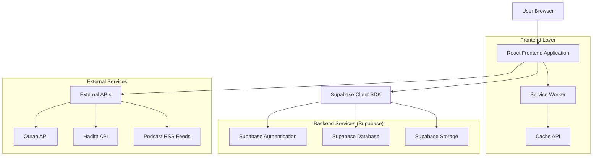
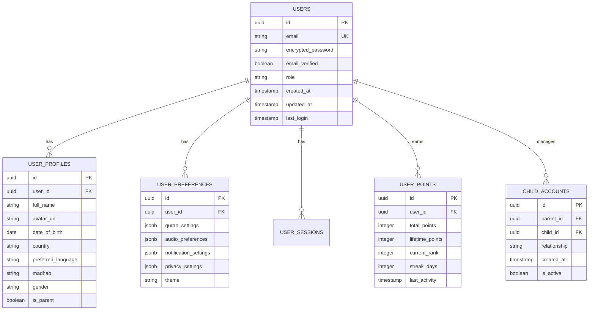
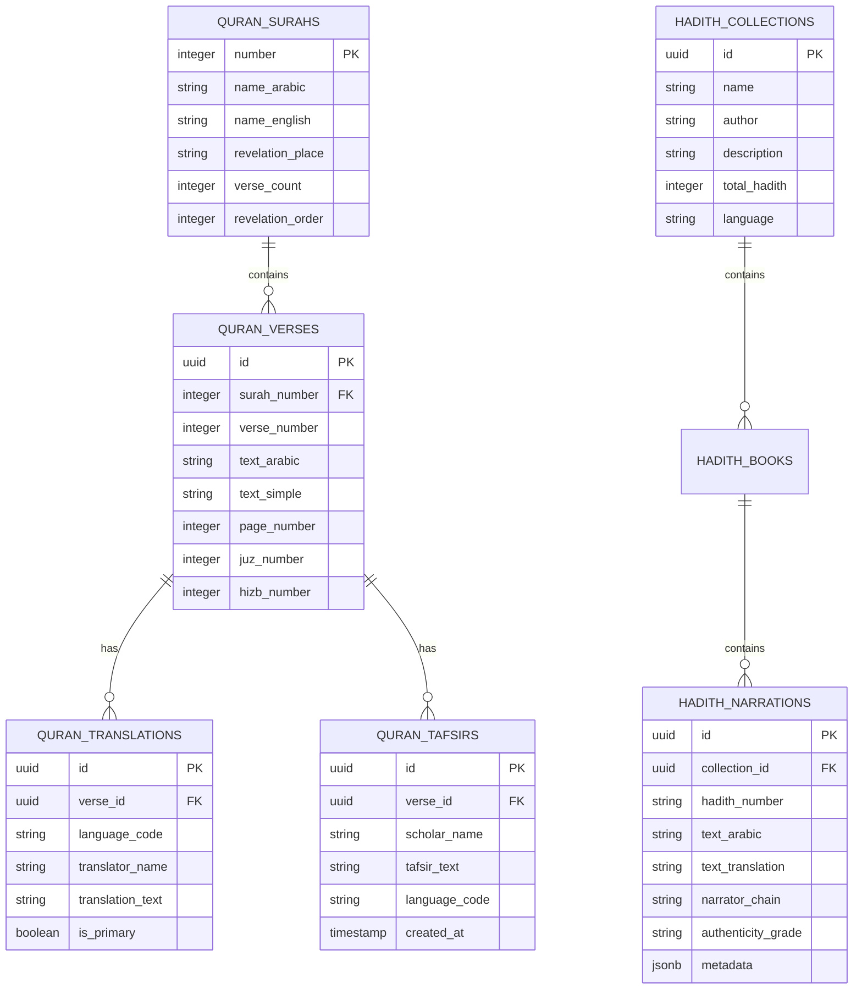
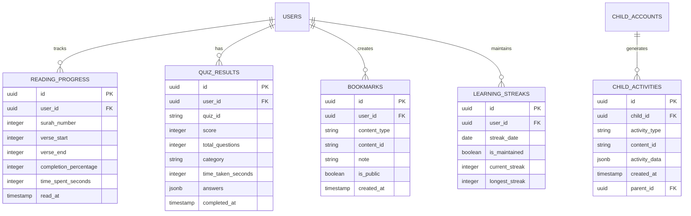
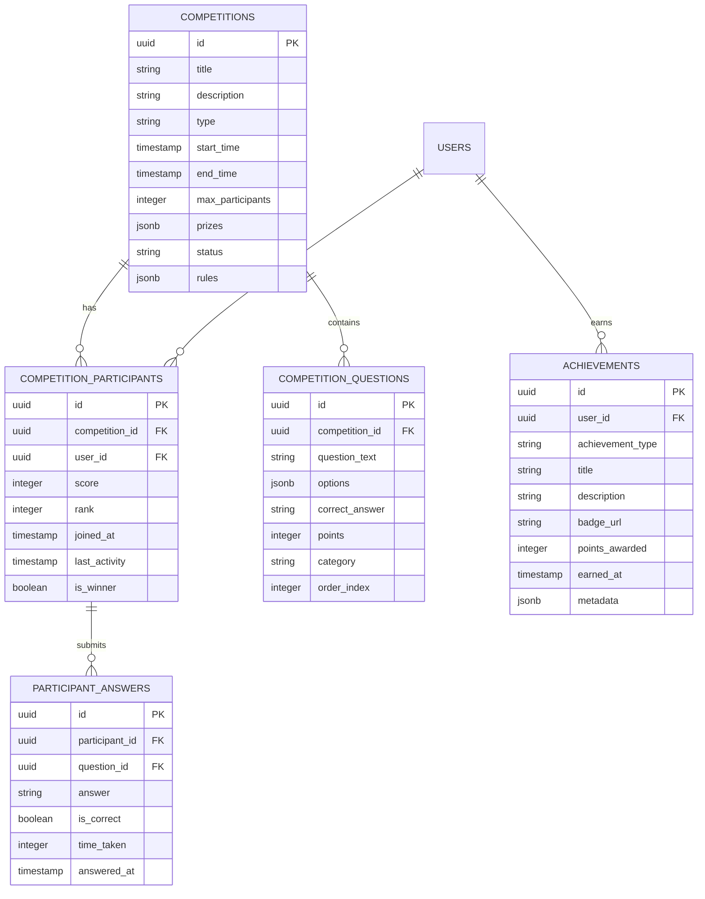

## 1. Architecture Design



## 2. Technology Description

**Frontend Stack:**
- React 18.2.0 with TypeScript 5.0
- Tailwind CSS 3.3 for styling
- Vite 4.4 for build tooling
- React Router 6.14 for navigation
- React Query 4.32 for state management
- Zustand 4.4 for global state
- Framer Motion 10.16 for animations
- React Hook Form 7.45 for forms
- React Player 2.12 for media playback

**Backend Services:**
- Supabase (PostgreSQL 15, Authentication, Storage, Real-time)
- No custom backend server required

**Development Tools:**
- ESLint 8.45 for code linting
- Prettier 3.0 for code formatting
- Husky 8.0 for git hooks
- Jest 29.6 for testing
- React Testing Library 13.4 for component testing

## 3. Route Definitions

| Route | Purpose | Authentication Required |
|-------|---------|------------------------|
| / | Homepage with featured content and navigation | No |
| /quran | Quran reader with translations and audio | No |
| /quran/[surah] | Specific Surah reading interface | No |
| /quran/bookmarks | User's bookmarked verses | Yes |
| /hadith | Hadith collections and search | No |
| /hadith/[collection] | Specific Hadith collection | No |
| /hadith/search | Advanced Hadith search | No |
| /kids | Kids zone with games and stories | No |
| /kids/games | Interactive Islamic games | No |
| /kids/stories | Animated Islamic stories | No |
| /articles | Islamic articles and blog posts | No |
| /articles/[category] | Articles by category | No |
| /articles/[slug] | Individual article page | No |
| /podcasts | Islamic podcasts and audio content | No |
| /podcasts/[series] | Podcast series page | No |
| /radio | Live Islamic radio streams | No |
| /competitions | Islamic knowledge competitions | Yes |
| /competitions/[id] | Specific competition page | Yes |
| /leaderboard | Global and friend leaderboards | Yes |
| /profile | User profile and settings | Yes |
| /dashboard | User dashboard with statistics | Yes |
| /parent-dashboard | Parent control panel | Yes (Parent role) |
| /auth/login | User login page | No |
| /auth/register | User registration page | No |
| /auth/forgot-password | Password recovery | No |
| /settings | User preferences and settings | Yes |

## 4. API Definitions

### 4.1 Authentication APIs (Supabase)

**User Registration**
```typescript
POST /auth/v1/signup

Request Body:
{
  email: string;
  password: string;
  data: {
    full_name: string;
    date_of_birth?: string;
    country?: string;
    preferred_language?: string;
    madhab?: string;
  }
}

Response:
{
  user: User;
  session: Session;
}
```

**User Login**
```typescript
POST /auth/v1/token

Request Body:
{
  email: string;
  password: string;
}

Response:
{
  user: User;
  session: Session;
  access_token: string;
  refresh_token: string;
}
```

### 4.2 Content APIs

**Quran Content**
```typescript
GET /api/quran/surahs
Response: Surah[]

GET /api/quran/surah/[number]
Response: {
  surah: Surah;
  verses: Verse[];
  translations: Translation[];
}

GET /api/quran/search
Query Params: q=string&language=string&limit=number
Response: SearchResult[]
```

**Hadith Content**
```typescript
GET /api/hadith/collections
Response: Collection[]

GET /api/hadith/collection/[id]/hadiths
Query Params: page=number&limit=number
Response: {
  hadiths: Hadith[];
  total: number;
  page: number;
}

GET /api/hadith/search
Query Params: q=string&collection=string&grade=string
Response: HadithSearchResult[]
```

### 4.3 User Progress APIs

**Reading Progress**
```typescript
POST /api/progress/reading
Request Body: {
  surah_number: number;
  verse_number: number;
  completion_percentage: number;
  time_spent: number;
}

GET /api/progress/reading/stats
Response: {
  total_read: number;
  streak_days: number;
  last_read: string;
  completion_rate: number;
}
```

**Quiz Results**
```typescript
POST /api/progress/quiz
Request Body: {
  quiz_id: string;
  score: number;
  total_questions: number;
  category: string;
  time_taken: number;
}

GET /api/progress/quiz/history
Response: QuizResult[]
```

### 4.4 Points System APIs

**Points Management**
```typescript
POST /api/points/earn
Request Body: {
  action: string;
  points: number;
  metadata?: object;
}

GET /api/points/balance
Response: {
  total_points: number;
  lifetime_points: number;
  rank: number;
  next_milestone: number;
}

GET /api/leaderboard
Query Params: type=global|friends&period=daily|weekly|monthly
Response: LeaderboardEntry[]
```

## 5. Database Schema Design

### 5.1 User Management Tables



### 5.2 Content Management Tables



### 5.3 Progress Tracking Tables



### 5.4 Competition and Leaderboard Tables



## 6. Data Definition Language (DDL)

### 6.1 Core User Tables

```sql
-- Users table (managed by Supabase Auth)
CREATE TABLE users (
    id UUID PRIMARY KEY DEFAULT auth.uid(),
    email TEXT UNIQUE NOT NULL,
    encrypted_password TEXT NOT NULL,
    email_verified_at TIMESTAMP WITH TIME ZONE,
    created_at TIMESTAMP WITH TIME ZONE DEFAULT NOW(),
    updated_at TIMESTAMP WITH TIME ZONE DEFAULT NOW(),
    role TEXT DEFAULT 'user' CHECK (role IN ('user', 'parent', 'premium', 'admin'))
);

-- User profiles table
CREATE TABLE user_profiles (
    id UUID PRIMARY KEY DEFAULT gen_random_uuid(),
    user_id UUID REFERENCES users(id) ON DELETE CASCADE,
    full_name TEXT NOT NULL,
    avatar_url TEXT,
    date_of_birth DATE,
    country TEXT,
    preferred_language TEXT DEFAULT 'en',
    madhab TEXT CHECK (madhab IN ('hanafi', 'maliki', 'shafii', 'hanbali')),
    gender TEXT CHECK (gender IN ('male', 'female')),
    is_parent BOOLEAN DEFAULT FALSE,
    created_at TIMESTAMP WITH TIME ZONE DEFAULT NOW(),
    updated_at TIMESTAMP WITH TIME ZONE DEFAULT NOW()
);

-- User preferences table
CREATE TABLE user_preferences (
    id UUID PRIMARY KEY DEFAULT gen_random_uuid(),
    user_id UUID REFERENCES users(id) ON DELETE CASCADE,
    quran_settings JSONB DEFAULT '{"font_size": "medium", "reciter": "mishary", "translation": "sahih_international"}',
   